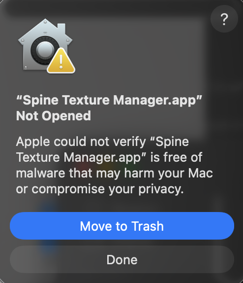
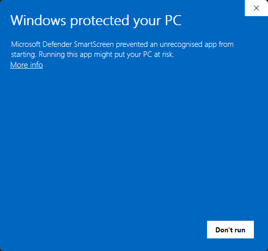
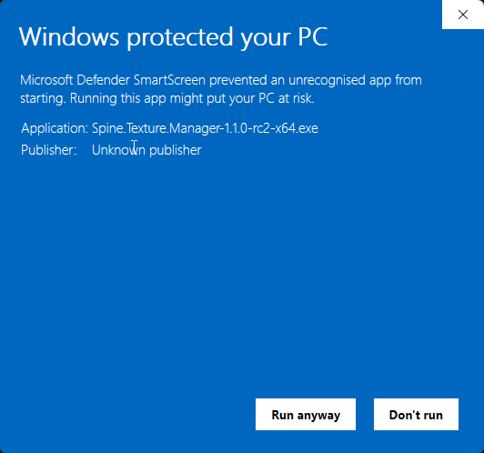

# Installing Spine Texture Manager

Pre-built installers are published to GitHub Releases for each tagged version. This guide walks through download → install → first-launch on macOS, Windows, and Linux. No `git`, Node.js, or developer tooling required.

> **Latest release:** [github.com/Dzazaleo/Spine_Texture_Manager/releases](https://github.com/Dzazaleo/Spine_Texture_Manager/releases)
>
> Pick the asset that matches your OS:
>
> - macOS (Apple Silicon): `Spine-Texture-Manager-<version>-arm64.dmg`
> - Windows (64-bit): `Spine-Texture-Manager-<version>-x64.exe`
> - Linux (64-bit AppImage): `Spine-Texture-Manager-<version>-x86_64.AppImage`

---

## macOS

**Note:** This build is signed ad-hoc, not with an Apple Developer ID. The first launch requires a one-time Gatekeeper bypass. The app behaves normally afterward — open from Applications, Launchpad, or Spotlight.

### Steps

1. Download `Spine-Texture-Manager-<version>-arm64.dmg` from the Releases page.
2. Double-click the downloaded `.dmg`. macOS mounts the disk image and shows a Finder window with the app icon next to an Applications folder shortcut.
3. Drag **Spine Texture Manager.app** into **Applications**.
4. Open **Applications** in Finder. **Right-click** (or Control-click) the app icon. Choose **Open** from the context menu. (Double-clicking does NOT work on first launch — that's the Gatekeeper restriction.)
5. macOS shows: _"App cannot be opened because the developer cannot be verified."_ Click **Open Anyway** (or **Open** depending on macOS version):

   

   _(Screenshot pending — capture during phase 12.1 with first real tester install on rc2.)_

6. The app launches. Future launches work normally — double-click from Applications, Spotlight (`Cmd+Space` → type "Spine Texture Manager"), or Launchpad.

### Troubleshooting

- **"App is damaged and can't be opened"**: the macOS quarantine attribute is sometimes set on downloaded files in unexpected ways. In Terminal, clear quarantine and re-attempt step 4:

  ```bash
  xattr -cr "/Applications/Spine Texture Manager.app"
  ```

- **System Settings → Privacy & Security alternative**: if the right-click → Open path is unavailable on your macOS version, open **System Settings → Privacy & Security**, scroll to the bottom, and click **Open Anyway** next to the Spine Texture Manager row.

---

## Windows

**Note:** This build is unsigned (no EV code-signing certificate). The first launch requires a one-time SmartScreen bypass. The app behaves normally afterward — launch from the Start Menu.

### Steps

1. Download `Spine-Texture-Manager-<version>-x64.exe` from the Releases page.
2. Double-click the downloaded `.exe`. Windows SmartScreen shows: _"Microsoft Defender SmartScreen prevented an unrecognized app from starting."_

   

   _(Screenshot pending — capture during phase 12.1 with first real tester install on rc2.)_

3. Click **More info**. The dialog expands to show "Publisher: Unknown publisher" and a **Run anyway** button.

   

   _(Screenshot pending — capture during phase 12.1 with first real tester install on rc2.)_

4. Click **Run anyway**. The NSIS installer launches.
5. Follow the installer prompts. The default install location (`%LOCALAPPDATA%\Programs\Spine Texture Manager`) is per-user — no admin rights required.
6. Launch from the Start Menu (search "Spine Texture Manager") or the Desktop shortcut if the installer offered one.

### Troubleshooting

- **The `.exe` doesn't open after Run anyway**: confirm the file is fully downloaded (size matches the GitHub Releases asset listing). If the file is truncated, redownload.
- **Antivirus quarantines the installer**: Windows Defender occasionally flags unsigned NSIS installers. Whitelist the `.exe` in your AV's quarantine list, or contact your IT department if you are on a managed machine.

---

## Linux

**Note:** This is a portable AppImage — no installer, no system-wide install. Just download, mark executable, run. Tested against Ubuntu 22.04+ and Fedora 40+.

### Steps

1. Download `Spine-Texture-Manager-<version>-x86_64.AppImage` from the Releases page.
2. Mark the file executable. In Terminal:

   ```bash
   chmod +x ~/Downloads/Spine-Texture-Manager-*.AppImage
   ```

   Or right-click in your file manager → Properties → Permissions → Allow executing as program.

3. Install the FUSE library (one-time setup; required for AppImage launch):

   **On Ubuntu 24.04 and later:**

   ```bash
   sudo apt install libfuse2t64
   ```

   **On Ubuntu 22.04 and earlier (and most other distros — Fedora, Debian 11, etc.):**

   ```bash
   sudo apt install libfuse2
   ```

   _If you skip step 3 and run the AppImage, you'll see a "dlopen(): error loading libfuse.so.2" error. That's the libfuse2-not-installed signal._

   

   _(Screenshot pending — capture during phase 12.1 with first real tester install on rc2.)_

4. Launch:

   ```bash
   ~/Downloads/Spine-Texture-Manager-*.AppImage
   ```

   Or double-click in your file manager.

### Troubleshooting

- **AppImage won't run after libfuse2 install**: confirm the file is executable (`ls -l ~/Downloads/Spine-Texture-Manager-*.AppImage` should show `-rwxr-xr-x` or similar). If not, redo `chmod +x`.
- **Wayland-only systems**: Electron apps run under XWayland by default and should work on GNOME 46+ / KDE Plasma 6 + Wayland sessions without extra configuration.

---

## After installation: auto-update

Once installed, the app checks GitHub Releases for newer versions on startup (silently — only shows a prompt if an update is available). You can also check manually via **Help → Check for Updates** in the app menu.

On macOS and Linux, accepting an update downloads the new version and prompts you to restart. On Windows, the same flow runs if your install is auto-update-capable; if not, the app shows a non-blocking notice with a button to open the Releases page where you can download the new installer manually.

---

## Reporting issues

Found a bug? Open an issue at [github.com/Dzazaleo/Spine_Texture_Manager/issues](https://github.com/Dzazaleo/Spine_Texture_Manager/issues). Include:

- Your OS + version (e.g. macOS 14.4, Windows 11 23H2, Ubuntu 24.04).
- The app version (the file name of the installer you ran, or check **Help → About** if available).
- Steps to reproduce + the output you expected vs got.
